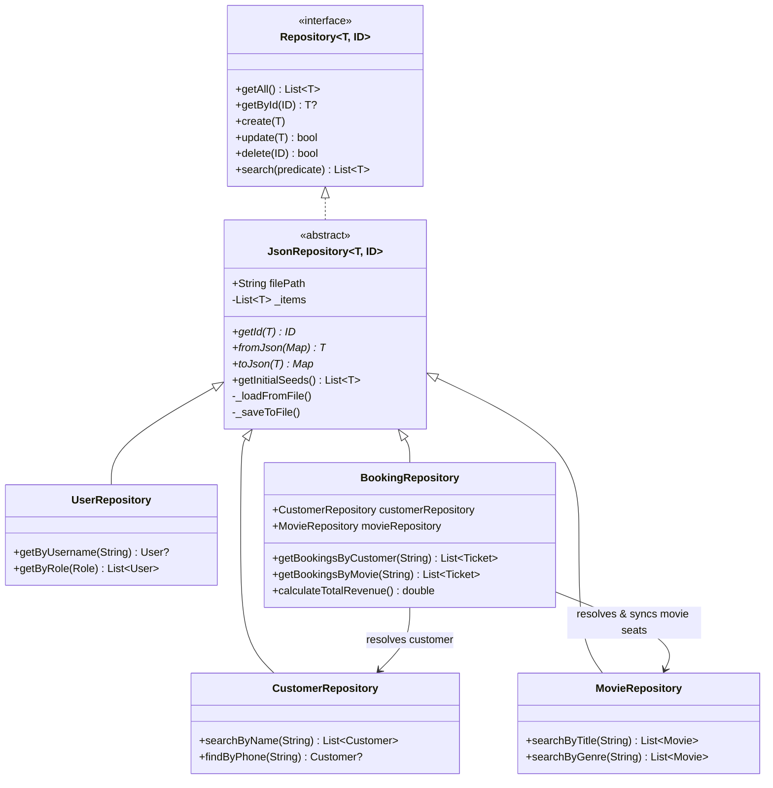

# PROJECT DOCUMENTATION
## Cinema Management & Ticket Booking System with Repository Pattern & RBAC

---

### 7.1 Cover Page

* **Project Title:** Cinema Management & Ticket Booking System
* **Architecture:** Repository Pattern with JSON Persistence & Role-Based Access Control (RBAC)
* **Class:** Year 3 / Semester 2 (Mobile Application Development)
* **Subject:** Object-Oriented Programming with Dart
* **Submission Date:** October 2026

---

### 7.2 Project Overview

* **Selected System:** Cinema Management & Ticket Booking System.
* **Purpose of the System:** Automates screening schedules, seat allocations, customer accounts, and ticket issuance. It calculates final ticket prices based on seat tiers (Standard vs. VIP) and movie formats (Standard vs. 3D IMAX), enforces Role-Based Access Control (Admin vs. Staff) with SHA-256 encrypted credentials, and uses the **Repository Pattern** to persist application state to human-readable JSON files (`data/`).
* **Why this System was Chosen:** A cinema system naturally embodies object-oriented domain modeling. Objects such as `Customer`, `Seat`, `Movie`, `Ticket`, `User`, and `Cinema` have clear real-world attributes, behaviors, and relationships. It demonstrates classes, objects, attributes, methods, list handling, all four Dart constructor types (Default, Parameterized, Named, and Factory), separation of concerns, and data persistence.

---

### 7.3 System Objects / Classes

| Class / Enum Name | Description |
| :--- | :--- |
| **`Role`** | Enum defining user privileges: `admin` or `staff`. |
| **`User`** | System operator account containing username, SHA-256 password hash, role, and creation timestamp. |
| **`Customer`** | Theater patron with identifying contact information (ID, Name, Phone, Email). |
| **`Seat`** | Physical seat in a theater hall with row, number, booking status flag, and price multiplier. |
| **`Movie`** | Screening event including ID, title, genre, showtime, base price, and a list of seats. |
| **`Ticket`** | Issued receipt linking a customer, movie, and seat with calculated price and timestamp. |
| **`Repository<T, ID>`** | Generic abstract interface defining standard CRUD and search operations. |
| **`JsonRepository<T, ID>`** | Abstract base repository with file I/O, in-memory caching, auto-seeding, and write-through sync. |
| **`UserRepository`** | Concrete repository managing `data/users.json`. |
| **`CustomerRepository`** | Concrete repository managing `data/customers.json`. |
| **`MovieRepository`** | Concrete repository managing `data/movies.json`. |
| **`BookingRepository`** | Concrete repository managing `data/bookings.json` with relational foreign keys. |
| **`AuthService`** | Handles login/logout sessions and enforces authorization guards (`requireAuth`, `requireAdmin`). |
| **`Cinema`** | Coordinates business logic across repositories, enforcing security and operational workflows. |

---

### 7.4 Data Schemas for JSON Storage (`data/` Directory)

All state is stored under the root-level `data/` directory in formatted JSON:

#### 1. `data/users.json`
Stores user authentication records with SHA-256 hashed passwords.
```json
[
  {
    "username": "admin",
    "passwordHash": "240be518fabd2724ddb6f04eeb1da5967448d7e831c08c8fa822809f74c720a9",
    "role": "admin",
    "createdAt": "2026-10-02T18:00:00.000"
  },
  {
    "username": "staff",
    "passwordHash": "10176e7b7b24d317acfcf8d2064cfd2f24e154f7b5a96603077d5ef813d6a6b6",
    "role": "staff",
    "createdAt": "2026-10-02T18:00:00.000"
  }
]
```

#### 2. `data/movies.json`
Stores screening records along with the state of each hall seat.
```json
[
  {
    "id": "MOV001",
    "title": "Avatar: The Way of Water",
    "genre": "Sci-Fi / Adventure",
    "showtime": "14:00 PM",
    "ticketPrice": 9.5,
    "seats": [
      {
        "id": "A1",
        "seatRow": "A",
        "seatNumber": 1,
        "isBooked": false,
        "priceMultiplier": 1.0
      }
    ]
  }
]
```

#### 3. `data/customers.json`
Stores patron contact profiles.
```json
[
  {
    "id": "C101",
    "name": "Sophea Chan",
    "phone": "012-345-678",
    "email": "sophea@gmail.com"
  }
]
```

#### 4. `data/bookings.json`
Stores booking records referencing customer, movie, and seat identifiers.
```json
[
  {
    "ticketId": "TKT-101",
    "customerId": "C101",
    "movieId": "MOV001",
    "seatId": "A1",
    "finalPrice": 9.5,
    "bookingTime": "2026-10-02T18:30:00.000"
  }
]
```

---

### 7.5 Repository Pattern Architecture



---

### 7.6 Role-Based Access Control (RBAC)

The system enforces authentication and authorization guards at both the UI layer and the service layer:

| Feature / Action | Staff Role | Admin Role | Guard Enforced |
| :--- | :---: | :---: | :--- |
| **View Movies & Available Seats** | Yes | Yes | `auth.requireAuth()` |
| **View Customers** | Yes | Yes | `auth.requireAuth()` |
| **Register Customer** | Yes | Yes | `auth.requireAuth()` |
| **Book Ticket & Print Receipt** | Yes | Yes | `auth.requireAuth()` |
| **View All Bookings** | Yes | Yes | `auth.requireAuth()` |
| **Cinema Summary (Stats & Revenue)** | Yes | Yes | `auth.requireAuth()` |
| **Add New Movie** | No | Yes | `auth.requireAdmin()` |
| **Remove Movie** | No | Yes | `auth.requireAdmin()` |
| **Create Staff Account** | No | Yes | `auth.requireAdmin()` |
| **Delete User Account** | No | Yes | `auth.requireAdmin()` |
| **View User Accounts List** | No | Yes | `auth.requireAdmin()` |

---

### 7.7 Constructor Types Demonstrated

The project demonstrates all 4 constructor types supported in Dart across domain entities:

1. **Default Constructor:**
   - `Customer()` initializes default guest credentials (`id = 'C000'`, `name = 'Default Guest'`).
2. **Parameterized Constructor:**
   - `Customer.registered(...)`, `Seat(...)`, `Movie(...)`, `Ticket(...)`, `User(...)`, `Cinema(...)`.
3. **Named Constructor:**
   - `Customer.vip(...)` — creates VIP customer with custom email.
   - `Seat.vip(...)` — creates VIP seat with 1.5x price multiplier.
   - `Movie.blockbuster(...)` — creates 3D IMAX screening with 10 VIP seats.
   - `Ticket.complimentary(...)` — creates $0.00 promotional ticket.
   - `User.admin(...)` & `User.staff(...)` — role-specific user creation.
4. **Factory Constructor:**
   - `Customer.fromMap(...)` & `Customer.fromJson(...)` — parses maps/JSON.
   - `Seat.fromCode(...)` & `Seat.fromJson(...)` — parses seat codes (e.g., "B5").
   - `Movie.standard(...)` & `Movie.fromJson(...)` — standard presets and deserialization.
   - `Ticket.issue(...)` & `Ticket.fromJson(...)` — validates seat reservation, calculates price, resolves references.
   - `User.fromMap(...)` & `User.fromJson(...)` — user record deserialization.
