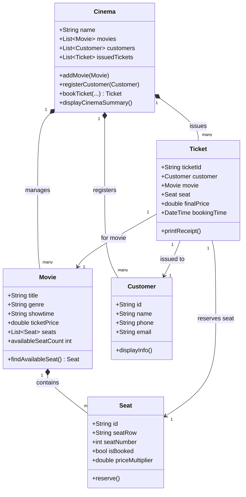

# PROJECT DOCUMENTATION
## Cinema Management & Ticket Booking System

---

### 7.1 Cover Page

* **Project Title:** Cinema Management & Ticket Booking System
* **Student Name:** [Your Name]
* **Class:** Year 3 / Semester 2 (Mobile Application Development)
* **Subject:** Object-Oriented Programming with Dart
* **Lecturer:** [Lecturer Name]
* **Submission Date:** September 30, 2026

---

### 7.2 Project Overview

* **Selected System:** Cinema Management & Ticket Booking System.
* **Purpose of the System:** The Cinema Booking System automates movie screening schedules, seat allocations, customer accounts, and ticket issuance. It calculates final ticket prices based on seat tiers (Standard vs. VIP) and movie formats (Standard vs. 3D IMAX), handles complimentary tickets, and generates cinema summary reports.
* **Why this System was Chosen:** A cinema system naturally embodies object-oriented domain modeling. Objects such as `Customer`, `Seat`, `Movie`, `Ticket`, and `Cinema` have clear real-world attributes, behaviors, and relationships. It offers an ideal context to demonstrate classes, objects, attributes, methods, list handling, and all four Dart constructor types (Default, Parameterized, Named, and Factory).

---

### 7.3 System Objects / Classes

| Class Name | Description |
| :--- | :--- |
| **`Customer`** | Represents a theater patron with identifying contact information (ID, Name, Phone, Email). |
| **`Seat`** | Represents a physical seat in a theater hall with row, seat number, booking status, and price multiplier. |
| **`Movie`** | Represents a movie screening event including title, genre, showtime, base price, and a list of seats. |
| **`Ticket`** | Represents an issued receipt linking a customer, a movie, and a reserved seat with a calculated price. |
| **`Cinema`** | The main system container managing lists of movies, customers, and issued tickets. |

---

### 7.4 Class Design

#### 1. `Customer`
| Component | Name | Data Type | Description |
| :--- | :--- | :--- | :--- |
| **Attribute** | `id` | `String` | Unique customer ID |
| **Attribute** | `name` | `String` | Full name of customer |
| **Attribute** | `phone` | `String` | Phone number |
| **Attribute** | `email` | `String` | Email address |
| **Constructor** | `Customer()` | Default | Constructs guest customer with default values |
| **Constructor** | `Customer.registered(...)` | Parameterized | Constructs registered customer with full details |
| **Constructor** | `Customer.vip(...)` | Named | Constructs VIP customer with custom email format |
| **Constructor** | `Customer.fromMap(...)` | Factory | Constructs customer object from key-value Map |
| **Method** | `displayInfo()` | `void` | Prints customer details to console |

#### 2. `Seat`
| Component | Name | Data Type | Description |
| :--- | :--- | :--- | :--- |
| **Attribute** | `id` | `String` | Seat ID (e.g. "A1", "V1") |
| **Attribute** | `seatRow` | `String` | Seat row identifier (e.g. "A", "B", "V") |
| **Attribute** | `seatNumber` | `int` | Seat number within row |
| **Attribute** | `isBooked` | `bool` | Reservation status flag |
| **Attribute** | `priceMultiplier` | `double` | Multiplier for pricing (1.0 for Standard, 1.5 for VIP) |
| **Constructor** | `Seat(...)` | Parameterized | Standard seat constructor |
| **Constructor** | `Seat.vip(...)` | Named | Creates VIP seat with 1.5x multiplier |
| **Constructor** | `Seat.fromCode(...)` | Factory | Parses code (e.g., "B5") into row and seat number |
| **Method** | `reserve()` | `void` | Marks seat as booked |
| **Method** | `cancelReservation()` | `void` | Unmarks seat booking status |
| **Method** | `displayInfo()` | `void` | Displays seat details and status |

#### 3. `Movie`
| Component | Name | Data Type | Description |
| :--- | :--- | :--- | :--- |
| **Attribute** | `title` | `String` | Title of the movie |
| **Attribute** | `genre` | `String` | Movie category / genre |
| **Attribute** | `showtime` | `String` | Scheduled screening time |
| **Attribute** | `ticketPrice` | `double` | Base ticket price |
| **Attribute** | `seats` | `List<Seat>` | List of seats available for this movie |
| **Constructor** | `Movie(...)` | Parameterized | Creates custom movie screening |
| **Constructor** | `Movie.blockbuster(...)` | Named | Creates 3D IMAX blockbuster movie with VIP seats |
| **Constructor** | `Movie.standard(...)` | Factory | Returns standard movie with default price |
| **Method** | `availableSeatCount` | `int` (getter) | Returns number of unbooked seats |
| **Method** | `findAvailableSeat()` | `Seat?` | Finds and returns first unbooked seat |
| **Method** | `displayInfo()` | `void` | Displays movie details |

#### 4. `Ticket`
| Component | Name | Data Type | Description |
| :--- | :--- | :--- | :--- |
| **Attribute** | `ticketId` | `String` | Unique ticket serial code |
| **Attribute** | `customer` | `Customer` | Associated customer object |
| **Attribute** | `movie` | `Movie` | Associated movie object |
| **Attribute** | `seat` | `Seat` | Associated seat object |
| **Attribute** | `finalPrice` | `double` | Final calculated price |
| **Attribute** | `bookingTime` | `DateTime` | Timestamp of ticket issue |
| **Constructor** | `Ticket(...)` | Parameterized | Low-level ticket constructor |
| **Constructor** | `Ticket.complimentary(...)` | Named | Creates free ticket ($0.00) |
| **Constructor** | `Ticket.issue(...)` | Factory | Validates seat, calculates price, reserves seat, and returns ticket |
| **Method** | `printReceipt()` | `void` | Prints ticket receipt to console |

#### 5. `Cinema`
| Component | Name | Data Type | Description |
| :--- | :--- | :--- | :--- |
| **Attribute** | `name` | `String` | Name of cinema branch |
| **Attribute** | `movies` | `List<Movie>` | List of movies currently showing |
| **Attribute** | `customers` | `List<Customer>` | List of registered customers |
| **Attribute** | `issuedTickets` | `List<Ticket>` | List of issued tickets |
| **Constructor** | `Cinema(...)` | Parameterized | Initializes cinema with branch name |
| **Method** | `addMovie()` | `void` | Adds movie to cinema catalog |
| **Method** | `registerCustomer()` | `void` | Adds customer to system |
| **Method** | `bookTicket()` | `Ticket?` | Orchestrates booking logic |
| **Method** | `showMovies()` | `void` | Lists all active movies |
| **Method** | `showCustomers()` | `void` | Lists all registered customers |
| **Method** | `viewAllBookings()` | `void` | Displays receipts of all tickets |
| **Method** | `displayCinemaSummary()` | `void` | Prints overall cinema statistics |

---

### 7.5 Constructor Design

The project demonstrates all 4 constructor types supported in Dart:

#### 1. Default Constructor
* **Where Used:** `Customer()` in `lib/models/customer.dart`.
* **Why Used:** Used to construct a generic/anonymous customer with default fallback values (`id = 'C000'`, `name = 'Default Guest'`) without requiring explicit arguments from the caller.
* **How Object is Created:** Assigns default constant values directly during initializer list execution.

#### 2. Parameterized Constructor
* **Where Used:** `Customer.registered()`, `Seat()`, `Movie()`, `Ticket()`, `Cinema()`.
* **Why Used:** Allows the caller to pass explicit values for fields when instantiating objects.
* **How Object is Created:** Directly initializes class fields from constructor arguments passed at call site.

#### 3. Named Constructor
* **Where Used:** `Customer.vip()`, `Seat.vip()`, `Movie.blockbuster()`, `Ticket.complimentary()`.
* **Why Used:** Provides alternative, domain-specific ways to construct objects with predefined properties (e.g., VIP customer email formatting, VIP seat price multiplier of 1.5x, 3D IMAX blockbuster movie settings, or $0.00 complimentary tickets).
* **How Object is Created:** Uses named constructor identifiers (`Class.constructorName`) to execute specialized initializer lists.

#### 4. Factory Constructor
* **Where Used:** `Customer.fromMap()`, `Seat.fromCode()`, `Movie.standard()`, `Ticket.issue()`.
* **Why Used:** Enables pre-construction logic (such as string parsing, dictionary mapping, validation, seat availability checks, and price calculation) before creating or returning an instance.
* **How Object is Created:** Uses the `factory` keyword to run code blocks and return constructed instances (or throw exceptions if validation fails).

---

### 7.6 Class Relationship Diagram



---

### 7.7 OOP Implementation

Here is how each core OOP concept is implemented with source code snippets from the project:

#### 1. Class & Attribute
Classes encapsulate data and behavior. Attributes define the state of objects.
```dart
class Customer {
  String id;
  String name;
  String phone;
  String email;
  // ...
}
```

#### 2. Method
Methods define object behaviors.
```dart
void printReceipt() {
  print('Ticket ID: $ticketId');
  print('Customer : ${customer.name}');
  print('Price    : \$${finalPrice.toStringAsFixed(2)}');
}
```

#### 3. Default Constructor
Constructs objects without parameters.
```dart
Customer()
    : id = 'C000',
      name = 'Default Guest',
      phone = '000-000-0000',
      email = 'guest@cinema.com';
```

#### 4. Parameterized Constructor
Constructs objects by passing explicit parameters.
```dart
Customer.registered({
  required this.id,
  required this.name,
  required this.phone,
  required this.email,
});
```

#### 5. Named Constructor
Provides distinct constructors for specific initialization patterns.
```dart
Seat.vip({
  required this.id,
  required this.seatRow,
  required this.seatNumber,
})  : isBooked = false,
      priceMultiplier = 1.5;
```

#### 6. Factory Constructor
Performs custom logic or validation before returning an instance.
```dart
factory Seat.fromCode(String code) {
  final row = code.substring(0, 1).toUpperCase();
  final number = int.tryParse(code.substring(1)) ?? 1;
  return Seat(id: code, seatRow: row, seatNumber: number);
}
```

#### 7. Objects Working Together & List Management
Objects interact inside `bin/main.dart` to simulate cinema operations:
```dart
final cinema = Cinema(name: 'Major Cineplex');

// Managing Lists of Objects
cinema.registerCustomer(customer1);
cinema.addMovie(movie1);

// Objects Working Together
final ticket = cinema.bookTicket(
  customer: customer2,
  movie: movie1,
);
ticket?.printReceipt();
```
